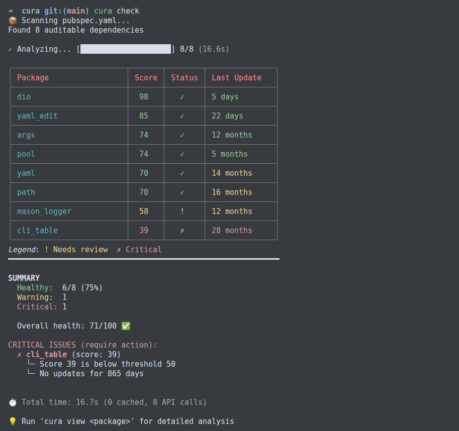
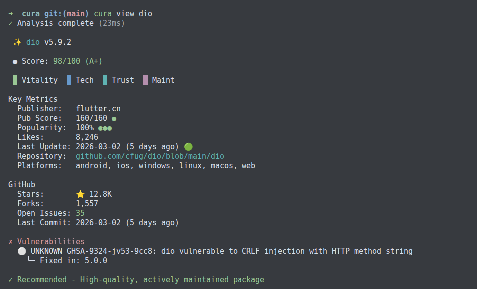

# Cura

<p align="center">
  <a href="https://pub.dev/packages/cura"></a>
  <a href="https://pub.dev/packages/cura/score"></a>
  <!-- <a href="https://pub.dev/packages/cura"></a> -->
  <a href="https://github.com/meragix/cura/actions"></a>
  <!-- <a href="https://codecov.io/gh/meragix/cura"></a> -->
  <a href="https://github.com/meragix/cura/blob/main/LICENSE"></a>
  <a href="https://github.com/meragix/cura"></a>
</p>

---

## Overview

Cura computes a health score (0–100) for each package in a Flutter or Dart project by querying pub.dev, GitHub, and OSV.dev. A weighted algorithm evaluates four dimensions: vitality, technical health, trust, and maintenance. The result is an objective, auditable metric for every dependency in the project.

A single command audits the entire dependency tree, surfaces security advisories, and integrates with CI/CD pipelines as a configurable quality gate.

```bash
dart pub global activate cura
cura check
```

---

## 📖 Table of Contents

- [Features](#-features)
- [Quick Start](#-quick-start)
- [Installation](#-installation)
- [Usage](#-usage)
  - [check](#check-command)
  - [view](#view-command)
  - [config](#config-command)
  - [cache](#cache-command)
- [Scoring Algorithm](#-scoring-algorithm)
- [Configuration](#️-configuration)
- [CI/CD Integration](#-cicd-integration)
- [Advanced Features](#-advanced-features)
- [Contributing](#-contributing)
- [License](#-license)

---

## ✨ Features

### Core

- **Full project audit**: analyzes every dependency declared in `pubspec.yaml`
- **Objective scoring**: 0–100 score computed by a transparent, weighted algorithm
- **Security checks**: CVE detection via OSV.dev; critical vulnerabilities force the score to 0
- **Smart suggestions**: recommends higher-scoring alternatives for low-scoring packages
- **Local JSON cache**: repeat runs are served from disk; TTL scales with package popularity; no native dependencies required

### Developer Experience

- **CLI output**: color-coded tables, progress bars, score breakdowns
- **Four themes**: Dark, Light, Minimal, Dracula
- **Hierarchical config**: project config overrides global config, which overrides built-in defaults
- **CI/CD ready**: structured exit codes, `--json` output, `--quiet` mode

### Data Sources

| Source       | Data retrieved                                        |
|--------------|-------------------------------------------------------|
| **pub.dev**  | Pana score, likes, popularity, publisher verification |
| **GitHub**   | Stars, forks, open issues, commit cadence             |
| **OSV.dev**  | Security advisories (CVEs)                            |

---

## ⚡ Quick Start

```bash
# 1. Install
dart pub global activate cura

# 2. Audit your project
cd my_flutter_app
cura check

# 3. Inspect a single package
cura view riverpod

# 4. Enforce a quality gate in CI
cura check --min-score 75 --fail-on-vulnerable
```

**Sample output:**



---

## 📥 Installation

### Recommended: global activation

```bash
dart pub global activate cura
cura --version
```

`~/.pub-cache/bin` must be in your `PATH`. The Dart installer adds it automatically. If not present, add it manually:

```bash
export PATH="$PATH:$HOME/.pub-cache/bin"
```

### From source

```bash
git clone https://github.com/meragix/cura.git
cd cura
dart pub get
dart pub global activate --source path .
```

### Requirements

- Dart SDK ≥ 3.0.0
- Internet access for the first analysis (subsequent runs use the local cache)

---

## 🚀 Usage

### Check Command

Audits every dependency declared in `pubspec.yaml`.

```bash
cura check [options]
```

| Option                     | Description                                    |
|----------------------------|------------------------------------------------|
| `--path <path>`            | Project directory (default: current directory) |
| `--min-score <n>`          | Exit 1 when average score falls below `n`      |
| `--fail-on-vulnerable`     | Exit 1 if any CVEs are detected                |
| `--fail-on-discontinued`   | Exit 1 if any discontinued packages are found  |
| `--dev-dependencies`       | Include `dev_dependencies` in the audit        |
| `--no-github`              | Skip GitHub metrics (faster, works offline)    |
| `--json`                   | Emit results as JSON                           |
| `-q, --quiet`              | Suppress all output except errors              |

**Examples:**

```bash
# Audit the current project
cura check

# Strict CI gate: score >= 80, no CVEs, no discontinued packages
cura check --min-score 80 --fail-on-vulnerable --fail-on-discontinued

# Export a JSON report
cura check --json > report.json

# Offline mode (cached data only, no GitHub calls)
cura check --no-github

# Silent mode — check the exit code in scripts
cura check --quiet
echo $?   # 0 = all passed, 1 = failures
```

> Full CI/CD integration guide: [doc/ci-cd.md](doc/ci-cd.md)

---

### View Command

Displays the full health report for a single package.

```bash
cura view <package> [options]
```

| Option       | Description                         |
|--------------|-------------------------------------|
| `--verbose`  | Show score breakdown and API timing |
| `--json`     | Emit result as JSON                 |

**Examples:**

```bash
cura view dio
cura view dio --verbose
cura view dio --json | jq '.score.total'
```

**Output:**



---

### Config Command

Reads and writes Cura configuration.

```bash
cura config <subcommand> [options]
```

| Subcommand            | Description                                       |
|-----------------------|---------------------------------------------------|
| `show`                | Print the active configuration (merged hierarchy) |
| `init`                | Create a project config at `./.cura/config.yaml`  |
| `set <key> <value>`   | Set a value in the global or project config       |
| `get <key>`           | Print a single config value                       |

**Examples:**

```bash
# Inspect the full active config
cura config show

# Apply a GitHub token globally
cura config set github_token ghp_xxxxx

# Set a project-level quality gate
cura config set min_score 85 --project

# Choose a theme
cura config set theme dracula
```

> Full configuration reference: [doc/configuration.md](doc/configuration.md)

---

### Cache Command

Manages the local JSON file cache without triggering package analysis.

```bash
cura cache <subcommand>
```

| Subcommand  | Description                                          |
|-------------|------------------------------------------------------|
| `stats`     | Show entry counts per table                          |
| `clear`     | Delete all cached entries (prompts for confirmation) |
| `cleanup`   | Remove only expired entries, keep valid ones         |

**Examples:**

```bash
# Inspect cache occupancy
cura cache stats

# Purge all entries
cura cache clear

# Remove expired entries
cura cache cleanup
```

**Sample `stats` output:**

```text
Cache Statistics:

  Package cache    : 47 entries
  Aggregated cache : 43 entries
  ──────────────────────────────
  Total            : 90 entries
```

> Cache internals, TTL strategy, and CI setup: [doc/caching.md](doc/caching.md)

---

## 📊 Scoring Algorithm

```text
Total Score = Vitality (40) + Technical Health (30) + Trust (20) + Maintenance (10)
            + Bonuses (variable) + Penalties (variable)
            clamped to [0, 100]
```

### Vitality — 40 pts

Reflects the recency and frequency of package updates.

| Last update  | Points |
|--------------|--------|
| < 1 month    |     40 |
| 1–3 months   |     35 |
| 3–6 months   |     28 |
| 6–12 months  |     20 |
| 1–2 years    |     10 |
| > 2 years    |      0 |

**Stability bonus (+5 pts):** Applies to packages with Pana score ≥ 130 and popularity > 70%, regardless of last update date.

**GitHub activity bonus (+5 pts):** Applies when the repository recorded more than 10 commits in the last 90 days.

### Technical Health — 30 pts

| Criterion                          | Points |
|------------------------------------|--------|
| Pana score (normalized from 0–130) |   0–15 |
| Null safety                        |     10 |
| Dart 3 compatible                  |      3 |
| Platform breadth (beyond 1st, max) |    0–2 |

### Trust — 20 pts

| Criterion                  | Points |
|----------------------------|--------|
| pub.dev likes (normalized) |   0–10 |
| Download popularity        |   0–10 |
| GitHub stars > 1 000       |     +3 |

### Maintenance — 10 pts

| Criterion              | Points |
|------------------------|--------|
| Verified publisher     |      5 |
| Flutter Favorite badge |      5 |

### Penalties

| Condition                                     | Deduction |
|-----------------------------------------------|-----------|
| No source repository                          |   −30 pts |
| Experimental `0.0.x` stalled > 1 year         |   −20 pts |

### Trusted Publisher Floor

Packages from trusted publishers (`dart.dev`, `flutter.dev`) receive a score floor of 70: their composite score is clamped to [70, 100]. Penalties and red flags still apply. Zero-score overrides (discontinued status, critical CVE) take precedence over the floor.

### Grade Mapping

| Score  | Grade | Meaning                      |
|--------|-------|------------------------------|
| 90–100 | A+    | Excellent, production-ready  |
| 80–89  | A     | Very good, recommended       |
| 70–79  | B     | Good, safe to use            |
| 60–69  | C     | Fair, use with caution       |
| 50–59  | D     | Poor, seek alternatives      |
| 0–49   | F     | Critical, avoid              |

### Automatic Zero

A score of **0** is forced (regardless of trusted-publisher status) when:

- The package is **discontinued**
- A **critical CVE** is detected via OSV.dev

> Detailed algorithm, red flags, recommendations, and examples: [doc/scoring.md](doc/scoring.md)

---

## ⚙️ Configuration

### Hierarchy

```text
CLI flags               (highest priority)
  ↓
./.cura/config.yaml     (project config — commit to share with your team)
  ↓
~/.cura/config.yaml     (global config — machine-level preferences)
  ↓
Built-in defaults       (lowest priority)
```

### Reference

| Key                     | Type   | Default | Description                                          |
|-------------------------|--------|---------|------------------------------------------------------|
| `theme`                 | string | `dark`  | `dark` / `light` / `minimal` / `dracula`             |
| `min_score`             | int    | `70`    | Minimum acceptable score                             |
| `github_token`          | string | —       | GitHub PAT (raises rate limit from 60 to 5 000 req/h)|
| `timeout_seconds`       | int    | `10`    | HTTP request timeout                                 |
| `ignore_packages`       | list   | `[]`    | Packages skipped during analysis                     |
| `fail_on_vulnerable`    | bool   | `false` | Exit 1 on any CVE                                    |
| `fail_on_discontinued`  | bool   | `false` | Exit 1 on discontinued packages                      |
| `show_suggestions`      | bool   | `true`  | Show alternative package suggestions                 |
| `verbose_logging`       | bool   | `false` | Log every API call and cache hit                     |

### Example: global config

```yaml
# ~/.cura/config.yaml
theme: dracula
github_token: ghp_your_token_here
min_score: 70
timeout_seconds: 15
show_suggestions: true
```

### Example: project config

```yaml
# ./.cura/config.yaml — commit this to enforce team standards
min_score: 85
fail_on_vulnerable: true
fail_on_discontinued: true
ignore_packages:
  - internal_test_helper
```

> Full key reference, best practices, and examples: [doc/configuration.md](doc/configuration.md)

---

## 🔄 CI/CD Integration

### GitHub Actions

```yaml
name: Dependency Health

on: [push, pull_request]

jobs:
  cura:
    runs-on: ubuntu-latest
    steps:
      - uses: actions/checkout@v4

      - uses: dart-lang/setup-dart@v1

      - name: Install Cura
        run: dart pub global activate cura

      - name: Audit dependencies
        run: cura check --min-score 75 --fail-on-vulnerable
        env:
          GITHUB_TOKEN: ${{ secrets.GITHUB_TOKEN }}
```

### GitLab CI

```yaml
dependency-health:
  image: dart:stable
  script:
    - dart pub global activate cura
    - cura check --min-score 80 --quiet
  allow_failure: false
```

### Exit Codes

| Code | Meaning                                              |
|------|------------------------------------------------------|
| `0`  | All packages passed                                  |
| `1`  | One or more packages failed the configured threshold |

> GitLab CI, CircleCI, JSON output, and troubleshooting: [doc/ci-cd.md](doc/ci-cd.md)

---

## 🎨 Advanced Features

### Themes

```bash
cura config set theme dracula     # persist globally
cura check --theme minimal        # per-invocation override
```

Available: `dark` (default), `light`, `minimal`.

> Theme details and CI recommendations: [doc/themes.md](doc/themes.md)

### Caching

Cura caches results as JSON files under `~/.cura/cache/`. TTL scales with package popularity:

| Popularity tier | TTL  |
|-----------------|------|
| `score >= 90`   | 24 h |
| `score >= 70`   | 12 h |
| `score >= 40`   | 6 h  |
| `score < 40`    | 3 h  |

```bash
cura cache stats    # inspect cache occupancy
cura cache cleanup  # sweep expired entries
cura cache clear    # wipe all entries
```

> File schema, TTL tiers, and CI cache setup: [doc/caching.md](doc/caching.md)

### GitHub Token

Without a token, GitHub enforces an anonymous rate limit of **60 requests/hour**. With a personal access token the limit rises to **5 000 requests/hour**.

```bash
cura config set github_token ghp_xxxxx
```

Generate a token at [github.com/settings/tokens](https://github.com/settings/tokens). No scopes are required for public repositories.

### Rate Limits Reference

| API      | Anonymous   | Authenticated |
|----------|-------------|---------------|
| pub.dev  | ~10 req/s   | —             |
| GitHub   | 60 req/h    | 5 000 req/h   |
| OSV.dev  | unlimited   | —             |

> Endpoints, auth setup, error handling, and concurrency: [doc/api-integration.md](doc/api-integration.md)

---

## 🤝 Contributing

### Bug Reports and Feature Requests

[Open an issue](https://github.com/meragix/cura/issues/new) with:

- A description of the problem or request
- Steps to reproduce (for bugs)
- Expected vs actual behaviour

### Pull Requests

```bash
# 1. Clone and set up
git clone https://github.com/meragix/cura.git
cd cura
dart pub get

# 2. Run the tool locally
dart run bin/cura.dart --help

# 3. Run the test suite
dart test

# 4. Check formatting and analysis
dart format --set-exit-if-changed .
dart analyze
```

Branch naming: `feat/description`, `fix/description`, `chore/description`.

See [CONTRIBUTING.md](CONTRIBUTING.md) for the full guide.

> Local setup, testing, and architecture: [doc/development.md](doc/development.md) · [doc/architecture.md](doc/architecture.md)

---

## 📚 Documentation

- [Scoring algorithm](doc/scoring.md)
- [Configuration reference](doc/configuration.md)
- [CI/CD integration](doc/ci-cd.md)
- [Themes](doc/themes.md)
- [API integration](doc/api-integration.md)
- [Caching](doc/caching.md)

---

## 📄 License

Cura is released under the [MIT License](LICENSE).

---

## Acknowledgments

- Inspired by [Pana](https://pub.dev/packages/pana) and [Snyk](https://snyk.io/)
- CLI output powered by [mason_logger](https://pub.dev/packages/mason_logger)
- Data provided by [pub.dev](https://pub.dev), [GitHub](https://github.com), and [OSV.dev](https://osv.dev)
