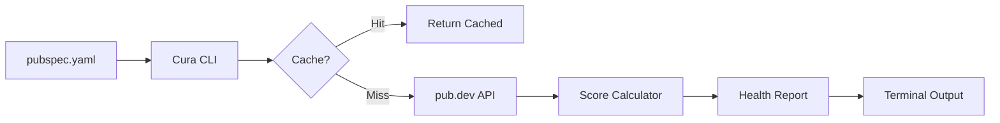

# Introduction

Welcome to **Cura** — the health monitor for your Dart dependencies.

## What is Cura?

Cura is a command-line tool that analyzes your `pubspec.yaml` and identifies:

- 🪦 **Dead packages** — Abandoned for 18+ months
- 🧪 **Vibe code** — Experimental packages not production-ready
- 🔓 **Unverified publishers** — Potential security risks
- 📄 **Poor documentation** — Packages with minimal README

## Why Cura?

The Dart/Flutter ecosystem on pub.dev contains thousands of packages. Many are:

- Created as learning experiments
- Abandoned after initial release
- Published without proper maintenance plans

**Cura helps you avoid these landmines** by providing an objective health score (0-100) for each dependency.

## Key Features (v0.1.0)

- ✅ **Health Scoring** — 0-100 score based on maintenance, trust, and popularity
- ✅ **View Command** — Inspect individual packages
- ✅ **Smart Caching** — 24-hour cache to respect pub.dev rate limits
- ✅ **Trusted Publishers** — Auto-whitelist for dart.dev, flutter.dev, google.dev
- ✅ **Stability Detection** — Don't penalize stable packages (130+ health points)

## How It Works

## Philosophy

Cura follows three core principles:

1. **Objectivity** — Scoring is algorithmic, not opinionated
2. **Transparency** — All scoring logic is open-source
3. **Developer-First** — Built by developers, for developers
